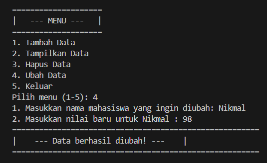

# Pratikum6
## Sub Rutin / Fungsi 

### Penjelasan Kode Program 
Kode program ini menggunakan list of dictionaries untuk menyimpan data mahasiswa. Setiap mahasiswa direpresentasikan oleh sebuah dictionary yang berisi: 
- "nama" : sebuah string yang menyimpan data mahasiswa
- "nilai" : sebuah angka (float) yang menyimpan nilai mahasiswa. 

## Fungsi-Fungsi dalam program 

### Fungsi tambah ()

Fungsi ini menambahkan data mahasiswa baru ke dalam list data_mahasiswa 
- nama = input("1. Masukkan nama mahasiswa: ") fungsi  meminta kita untuk menambahkan nama mahasiswa dan program akan menyimpan dalam dictionary. 

- Memasukkan nilai Mahasiswa. Nilai ini akan divalidasi menggunakan fungsi validasi_nilai() untuk memastikan nilainya berupa angka 

- data_mahasiswa.append ({"nama": nama, "nilai": nilai}): membuat dictionary dengan kunci nama dan nilai, lalu menambahkannya ke list data_mahasiswa menggunakan metode append()

### Fungsi tampilkan ()

Fungsi ini menampilkan semua data yang ada di dalam list 
- if not data_mahasiswa : Mengecek apakah daftar data_mahasiswa kosong. Apabila kosong maka program akan mencetak pesan. 

- Jika tidak kosong, program mencetak "Daftar Nilai Mahasiswa" diikuti dengan tabel yang berisi data mahasiswa, seperti nomor urut, nama, dan nilai.

- Program menggunakan enumerate() untuk memberikan nomor urut pada setiap mahasiswa. 

### Fungsi hapus(nama)

- Memasukkan nama mahasiswa yang ingin dihapus datanya. Input ini akan disimpan dalam variabel nama 

- Program menggunakan perulangan for untuk menelusuri setiap element setiap element dalam daftar data_mahasiswa

- if mhs['nama'].lower() == nama.lower(): Nama mahasiswa dalam daftar (mhs['nama']) dibandingkan dengan nama yang dimasukkan pengguna, tanpa memperhatikan huruf besar/kecil (lower()).

- Jika nama ditemukan : data_mahasiswa.remove(mhs) akan menghapus data mahasiswaa dari daftar

- Jika tidak ditemukan Program akan menampikan pesan. 

### Fungsi ubah(nama)

Fungsi ini memperbarui nilai mahasiswa berdasarkan nama yang diberikan. 

- Memasukkan nama mahasiswa yang ingin dihapus datanya. Input ini akan disimpan dalam variabel nama 

- if mhs['nama'].lower() == nama.lower(): Nama mahasiswa dalam daftar (mhs['nama']) dibandingkan dengan nama yang dimasukkan pengguna, tanpa memperhatikan huruf besar/kecil (lower()).

- Jika Nama ditemukan, Program meminta kita untuk memasukkan nilai baru untuk mahasiswa tersebbut. Input nilai divalidasi melalui fungsi validasi_nilai(). 

- Nilai lama pada dictionary mahasiswa diubah menjadi nilai baru (mhs['nilai'] = validasi_nilai(...)).

- Program akan mencetak pesan "Data Mahasiswa diubah!"

- Jika Nama tidak ditemukan maka akan terdapat pesan "Data mahasiswa tidak ditemukan"  

### Fungsi Validasi_nilai(pesan)

Fungsi ini digunakan untuk memastikan nilai yang dimasukkan oleh pengguna valid

- Menggunakan perulangan While True untuk meminta input hingga valid

- Jika nilai yang dimasukkan tidak berupa angka atau negatif, program meminta input ulang.

### Fungsi cetak_pesan(pesan)

Fungsi ini digunakan untuk mencetak pesan dengan dekorasi tambahan.

- Program akan menerima parameter string pesan
- Program mencetak pesan tersebut di dalam kotak dekorasi menggunakan karakter = untuk memperjelas informasi.

### Fungsi menu()

Fungsi ini merupakan menu utama yang menyediakan pilihan bagi pengguna untuk memilih aksi yang akan dilakukan 

- Program menampilkan menu pilihan: Tambah data, Tampilkan data, Hapus data, Ubah data, Keluar

- Pengguna diminta untuk memilih opsi dengan memasukkan angka. 

    - "1" = Tambah 
    - "2" = Tampilkan 
    - "3" = Hapus 
    - "4" = Ubah 
    - "5" = Keluar 

### HASIL KODE PROGRAM 

### OPSI ANGKA MEMILIH ANGKA 1
- Menambah data Mahasiwa

### OPSI MEMILIH ANGKA 2 

- Apabila ada data mahasiswa 

- Apabila Tidak ada Mahasiswa 

### OPSI MEMILIH ANGKA 3 
- Apabila Valid 

- Apabila Tidak Valid 

### OPSI MEMILIH ANGKA 4 
- Apabila Valid

Apabila Tidak Valid 

### OPSI MEMILIH ANGKA 5

## Penjelasan Flowchart 

- Mulai = Program akan dimulai dengan menyiapkan list kosong untuk menyimpan data mahasiswa. 

- Tampilkan menu utama = Program akan menampilkan menu utama dengan opsi berikut 
    - Tambah data 
    - Tampilkan data 
    - Hapus data
    - Ubah data
    - Keluar 

- Input Pilihan = Program akan meminta kita memilih kita opsi dari menu (1-5)

- Tambah data = memasukkan data mahasiswa seperti nama dan nilai 

- Tampilkan data = Program memeriksa apakah apakah ada data di daftar mahasiswa: Jika ada data maka data mahasiswa maka data akan ditampilkan, Jika tidak ada data maka program akan mencetak pesan. 

- Hapus data = Progam akan meminta untuk memasukkan nama mahasiwa yang ingin dihapus. 

- Ubah data : Program akan meminta kita memasukkan nama mahasiwa yang ingin di ubah, lalu masukkan nilai baru 

- End = Program akan berhenti setelah pengguna memilih keluar. 

